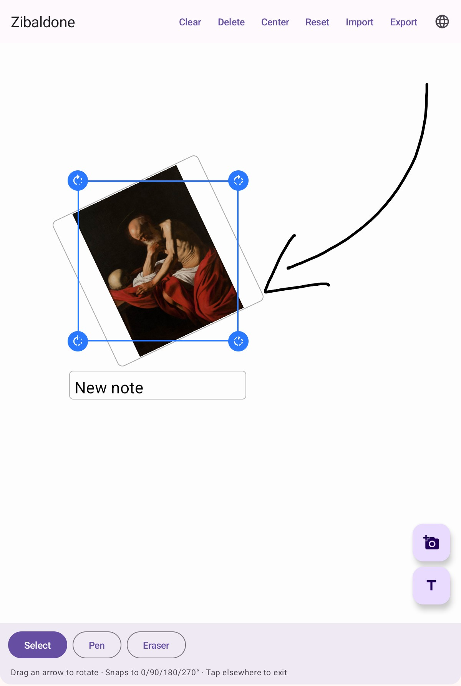
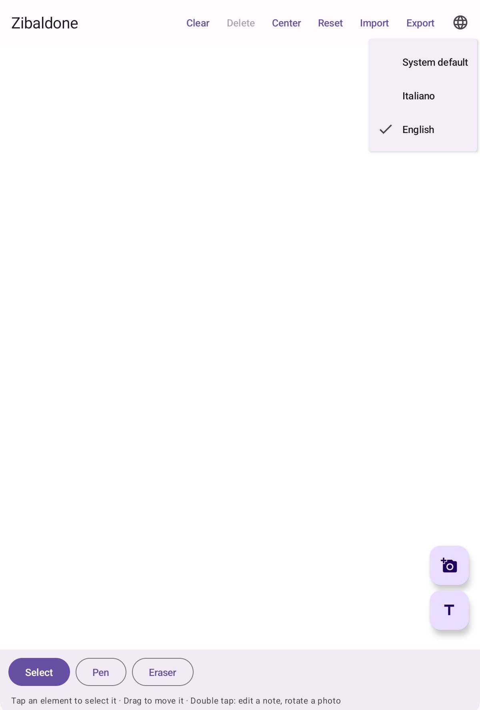

# Zibaldone

[](https://github.com/rrenz80/zibaldone/actions/workflows/ci.yml)
[](LICENSE)

An Android app for building moodboards on an **infinite canvas**: freehand drawing,
text notes and reference photos, all on a surface you pan and zoom with your fingers.

A *zibaldone* is the notebook where notes, clippings and stray thoughts pile up with
no predetermined order — a moodboard made of paper.

<p align="center">
  
  
</p>

## What it does

- **Three tools**: Select, Pen (2–24 dp width), Eraser with adjustable radius
  (12–64 dp) that erodes *only the part of the stroke it touches*, not the whole
  stroke.
- **Text notes** you can select, move and resize; double tap to edit them inline.
- **Photos** from the gallery: movable, resizable from the four corners and
  **rotatable** (double tap → curved arrows, snapping to 0/90/180/270°).
- **Two-finger pan and zoom** anchored on the pinch centroid (0.1×–10×).
- **Portable export/import** in a single `.zib` file: the photos travel inside the
  package, so a board opens on any device running the app.
- **Italian and English UI**, picked inside the app (globe icon in the top bar) or
  left to follow the system language.

## Building

Requires JDK 17 and the Android SDK (platform 34, build-tools 34.0.0).

```bash
export JAVA_HOME=/path/to/jdk-17
export ANDROID_HOME=$HOME/android-sdk
./gradlew :app:assembleDebug
```

The APK lands in `app/build/outputs/apk/debug/app-debug.apk`.

Code style is enforced with ktlint:

```bash
./gradlew :app:ktlintCheck    # check
./gradlew :app:ktlintFormat   # fix what can be fixed
```

`./gradlew :app:assembleRelease` also works from a fresh clone, and produces an
**unsigned** release APK. Signing is opt-in: create a `keystore.properties` at
the repo root (it is gitignored) pointing at your own keystore, and the release
build picks it up.

```properties
storeFile=/path/to/your/keystore.p12
storePassword=…
keyAlias=…
keyPassword=…
```

## Structure

A single `:app` module, entirely Jetpack Compose + Material 3. No database: the state
is a pure serializable model (`kotlinx.serialization`).

| Path | Role |
|---|---|
| `model/` | `BoardElement` (sealed: Drawing / TextNode / ImageNode) and id generation |
| `ui/BoardScreen.kt` | Scaffold, bars, FABs, layer order |
| `ui/BoardGesture.kt` | **The single dispatcher** for all pointer input |
| `ui/HitTesting.kt` | Manual hit testing in screen space |
| `ui/*Overlay.kt`, `ui/StrokeCanvas.kt` | Rendering of notes, photos and strokes |
| `util/CanvasMath.kt` | World↔screen math, stroke trimming for the eraser |
| `util/ExportImportManager.kt` | The `.zib` format (ZIP + manifest) |
| `util/AppLocale.kt` | UI language choice and how it is applied |
| `view/` | `BoardViewModel` and the camera state |

Two constraints that are not obvious from the code:

1. **The camera reaches rendering through layout only** (`Modifier.offset {}` /
   `.size()`), read in the *body* of the composable. Applying it inside a draw
   closure or through `graphicsLayer` was tried and does not work on the reference
   tablet.
2. **Every gesture lives in `BoardGesture.kt`**: nodes have no handlers of their own.

## License

MIT — see [`LICENSE`](LICENSE).

## Documentation

[`PROJECT.md`](PROJECT.md) is the project log: architecture, a version history with
the symptoms and root cause of every bug that was fixed, build lessons and known
limitations. It is the authoritative source; code comments are in English too.
